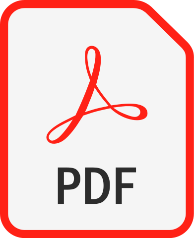

# Gitlab-PDF

Generación de Artefactos PDF con GitLab CI/CD.

> **Nota**: Para obtener más detalles sobre GitLab CI/CD, consulta el siguiente artículo [enlace]().

## ¿Por qué utilizar GitLab CI/CD?
El propósito principal es versionar todos los avances de los archivos LaTeX (`.tex`)
utilizando GitLab en lugar de GitHub. Esto se debe a que al emplear la funcionalidad de CI/CD de GitLab, los artefactos permanecen disponibles durante un período de tiempo mucho más prolongado, sin expirar, a diferencia de GitHub,
donde los artefactos tienen una duración máxima de 90 días.

> **Nota**: Puedes obtener más información sobre los artefactos en GitLab en [GitLab Artifacts](https://docs.gitlab.com/ee/ci/jobs/job_artifacts.html) y en GitHub en [Github Artifacts](https://docs.github.com/en/rest/actions/artifacts?apiVersion=2022-11-28).
## Proyectos

| Nombre                                                 | Descripción                                                               | Artefactos                                                                                                                                                                                                                                                  |
|--------------------------------------------------------|---------------------------------------------------------------------------|-------------------------------------------------------------------------------------------------------------------------------------------------------------------------------------------------------------------------------------------------------------|
| [cv](https://gitlab.com/fralfaro/cv)                   | Un Pipeline de integración continua para obtener un buen CV sin esfuerzo. |          |
| [dmat-latex](https://gitlab.com/fralfaro/dmat-latex)   | Plantillas LaTeX: Tarea, Beamer (DMAT - UTFSM).                           |  |

